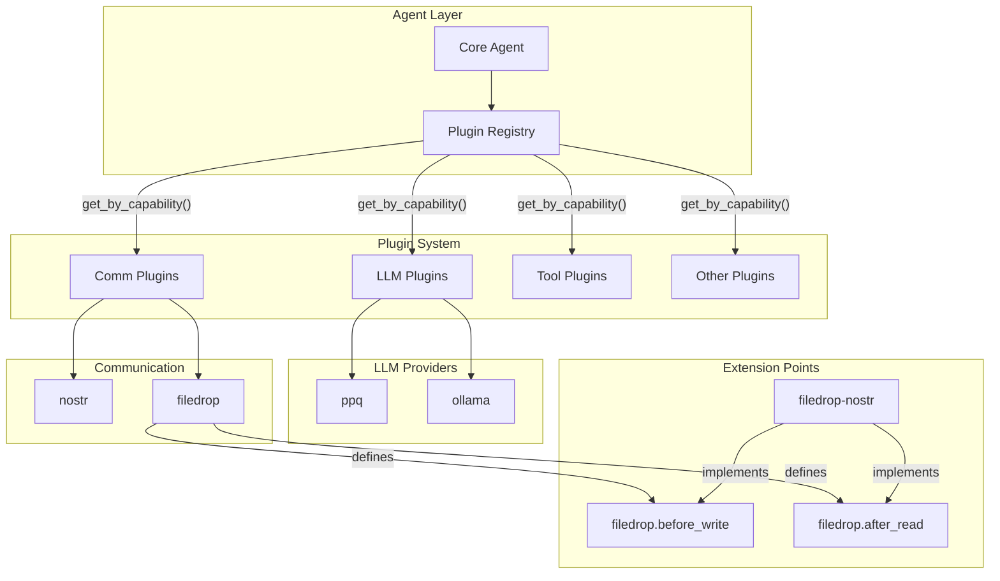
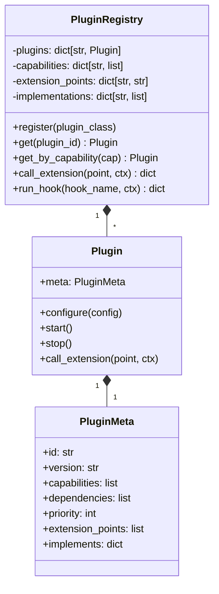
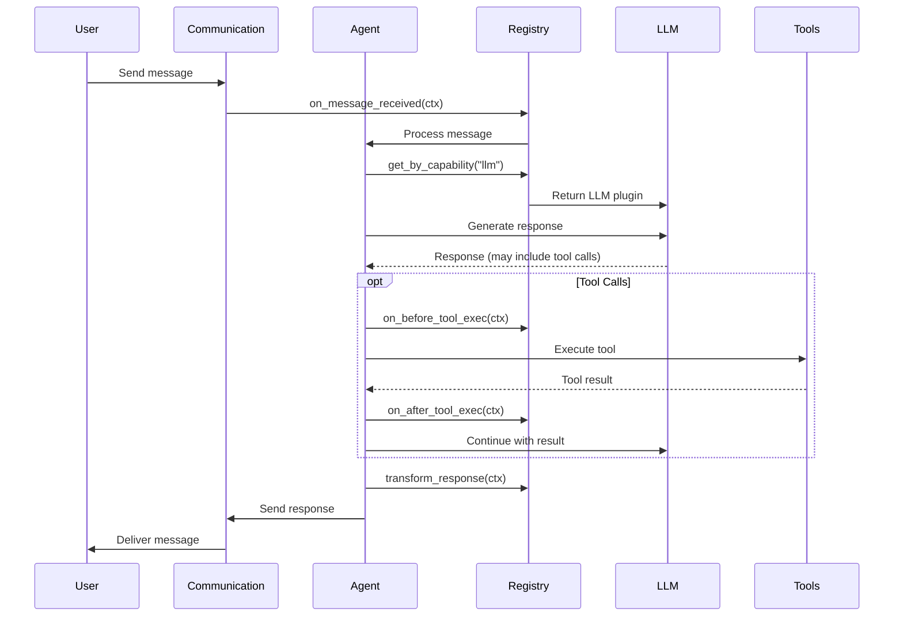
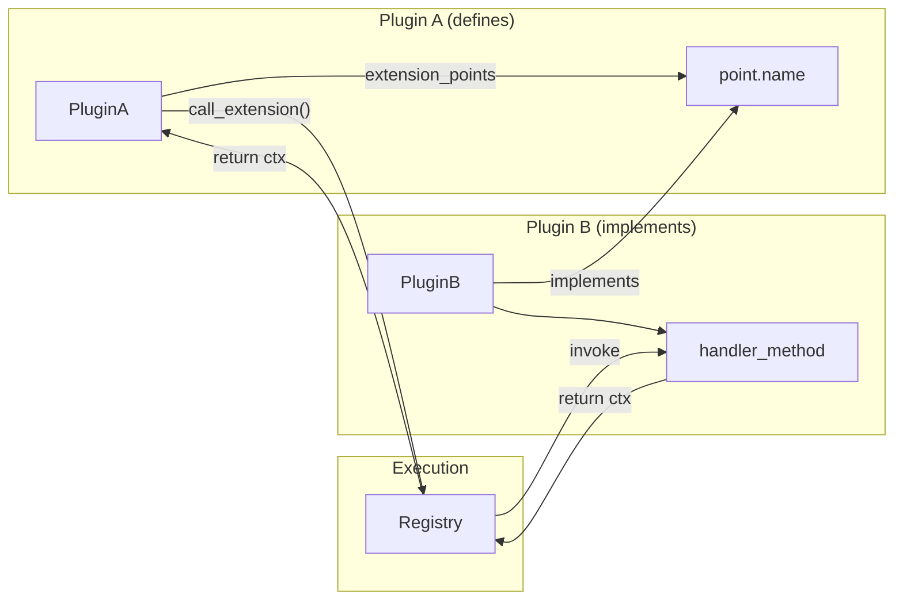
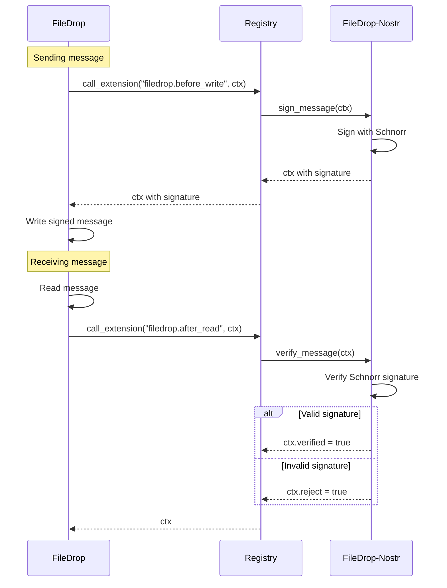
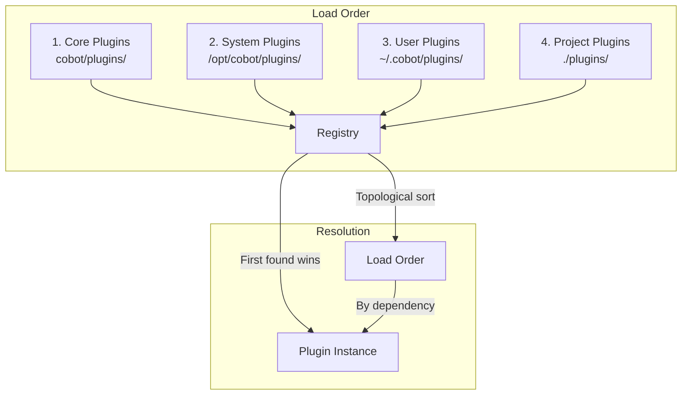
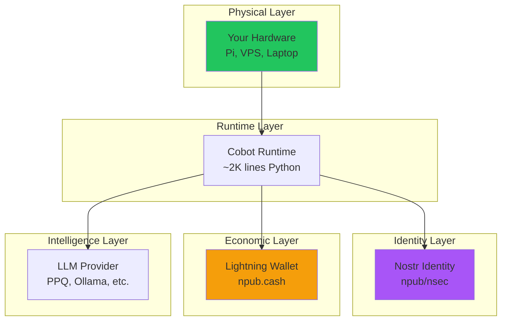

# Cobot Architecture

## Overview



## Plugin Registry

The registry is the heart of Cobot's plugin system.



## Message Flow



## Extension Points

Extension points allow plugins to define hooks that other plugins can implement.



### Example: FileDrop Signing



## Hook Chain

Plugins can intercept lifecycle events via hooks.


## Plugin Loading

Plugins are loaded from multiple paths in order:



## Sovereignty Stack



## Directory Structure

```
cobot/
├── cobot/
│   ├── __init__.py
│   ├── agent.py          # Core agent loop
│   ├── cli.py            # CLI commands
│   └── plugins/
│       ├── __init__.py   # Plugin discovery
│       ├── base.py       # Plugin base class
│       ├── registry.py   # Plugin registry
│       ├── interfaces.py # Capability interfaces
│       ├── config/       # Configuration plugin
│       ├── ppq/          # PPQ LLM provider
│       ├── ollama/       # Ollama LLM provider
│       ├── nostr/        # Nostr communication
│       ├── filedrop/     # FileDrop communication
│       ├── wallet/       # Lightning wallet
│       ├── tools/        # Shell/file tools
│       ├── security/     # Prompt injection shield
│       ├── persistence/  # Conversation memory
│       ├── compaction/   # Context management
│       └── logger/       # Logging
├── tests/                # Test suite
├── docs/                 # Documentation
├── cobot.yml.example     # Example config
├── SOUL.md.example       # Example system prompt
└── pyproject.toml        # Package config
```
